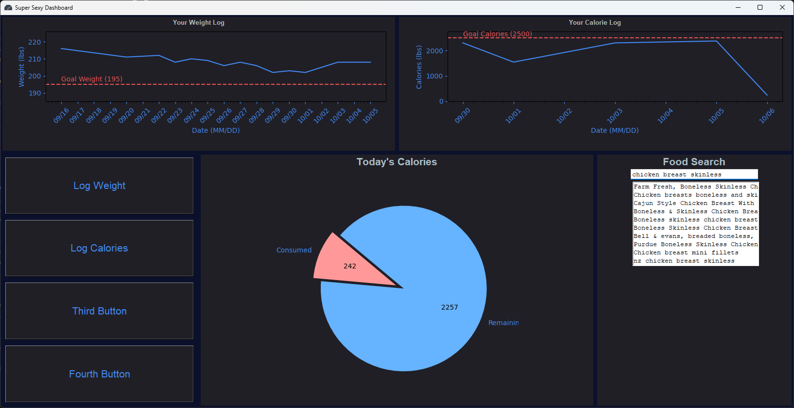

# CalorieTracker
## Description:
Just a Calorie Tracking application to get better with python, and tkinter for creating GUI's.  
Application also has a custom entry box which carries out a query to Open Food Facts website which gives user access to a large food facts database.




### Prerequisites
List any prerequisites, libraries, OS, or anything else that is required before installing the project. For example:
- Python 3.8+
- pip install pandas
- pip install icecream

### Installing
1. **Clone the Repository**
   ```sh
   git clone https://github.com/jaycherd/CalorieTracker.git
   ```

## Usage:
python main.py [arguments]
## Arguments:
- -rr, rerun the program as if it is the first time running - for new user to input their information

